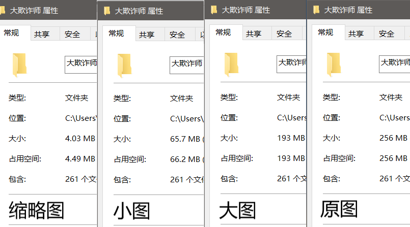

# LoftTagDownloader

根据Tag下载Lofter的文章、图片、外链图片 (仅[LoftTagDownloader.py](./LoftTagDownloader.py)支持外链图片)

<a target="_blank" href="https://colab.research.google.com/github/Justype/LoftTagDownloader/blob/master/ipynb/loft_mobile_hot_tag.ipynb"></a> 直接在Google Colab中使用 loft_mobile_hot_tag.py

## ℹ️ 注意

目前由于Lofter服务器端做了限制，任何组合只能获取到前1000的数据（网页与手机都只能刷到第1000个）

## loft_mobile_hot_tag.py

根据热门，统计数据，下载文章与图片 （目前不处理视频）

如果你想要的Tag有很多博文，建议按 月 1/2 博文类型 逐个解析，这样能获取最多的内容，有能力也可以自己写个循环

```python
# 例如：
标签 = "真三国无双";  筛选年月 = 202503;  博文类型 = "1"
标签 = "真三国无双";  筛选年月 = 202503;  博文类型 = "2"
```

会检查已下载的图片，如果大小相同会直接跳过

### 需要安装的库

``` bash
pip install requests  tqdm   markdownify
#           网络请求  进度条   Markdown转换
```

### 可以设置的参数

| 变量名 | 类型 | 介绍 | 示例值 |
|--------|------|------|--------|
| 标签 | string | 搜索的主标签 | `"真三国无双"` |
| 博文类型 | string | `空字符`：全部 `1`：文字 `2`：图片 `4`: 视频 | `0` |
| 筛选年月 | integer | `0`表示不筛选，或使用`YYYYMM`格式 | `202503` |
| **筛选参数** |||
| 白名单 | string | 只要包含其中一个标签就行（逗号或空格分隔） | `"绘图，3D"` |
| 完全白名单 | string | 必须包含所有标签才行（逗号或空格分隔） | `"曹操，郭嘉"` |
| 黑名单 | string | 包含其中一个标签就不行（逗号或空格分隔） | `"剧透，攻略"` |
| 最低热度 | integer | 低于这个热度的博文将被剔除 | `500` |
| 文本内容字数限制 | integer | 超过这个字数的博文将被剔除（仅在写入时生效） | `50` |
| **下载参数** |||
| 连接的最大线程数 | integer | 最大线程数（建议4-8） | `4` |
| 是否写文的内容 | boolean | 是否写入文本内容 | `False` |
| 是否写图的内容 | boolean | 是否写入图片内容 | `False` |
| 是否下载图片 | boolean | 是否下载图片 | `False` |


## LoftTagDownloader.py

目前如果100个/次请求，到~~10000~~ 1000就会停止，~~可以请求10000000.../次，但连接时间会超长~~ 连接时间过长直接断连。

### 需要安装的库

`requests`, `bs4`

```bash
pip install requests beautifulsoup4
#           网络请求  HTML处理
```

### 使用方法

下载`LoftTagDownloader.py`，修改可设置的部分，直接运行。

| 使用目的                      | 只下长文   | 只下图片 | 图文均下 |
| ----------------------------- | ---------- | -------- | -------- |
| `isDownloadBlogImg`           | `False`    | `True`   | `True`   |
| `isDownloadLinkImg`           | `False`    | `True`   | `True`   |
| `isDownloadBlogContent`       | `True`     | `False`  | `True`   |
| `isDownloadBlogWhileItHasImg` | `False`    | 无所谓   | `True`   |
| `blogMinLength`               | 建议 `200` | 无所谓   | 按需     |

```python
#region 可设置
tag = ""  # 标签名，如果不填，在命令行内输入

hotMin = 0          # 最低热度
blogMinDate = ""    # 最小时间 YYYY-mm-dd
ignoreTags = []     # 想要去除的标签 ['tag1', 'tag2']  不区分大小写
blogMinLength = 0   # 文章最小长度


isDownloadBlogImg = False    # 是否下载  博客图片
isDownloadLinkImg = False    # 是否下载  外链图片
isDownloadBlogContent = True  # 是否下载  文章
isDownloadBlogWhileItHasImg = True  # 如果博客有图片，是否下载文章
blogImgSize = "原图"    # 下载博客图片的大小 ("缩略图", "小图", "大图", "原图")
isSortByAuthor = False  # 是否按作者分类
```

下载图片大小的对比：



### 如果中途被断了

现在已经支持自动继续了，如果下到一半不想下载，请按`ctrl + c`中断应用。中断后想继续下载，请按如下操作：

① 找到日志`log.txt`，复制最后一次的`requestPosition`，`requestTime`

```
【开始请求】requestPosition= 0, requestTime= 0
【连接超时】requestPosition= 100, requestTime= 1513515723233
```

或者直接复制命令行内的两个值

② 然后粘贴到 `LoftTagDownloader.py` 内，如下：

```python
# 如果断了可以看 日志，然后修改下面两个继续
requestPosition = 100     # 请求位置      默认 0      每次递增 请求数
requestTime = '1513515723233'       # 请求博客的时间      默认 '0'
requestNum = 100        # 每次请求博客的个数
# 如果请求过于频繁，会被断连；如果每次请求过多，正则处理的慢。
```

③ 再次运行相同的tag

### 其他问题

1. 重新开始跑同一个Tag，会不会再次下载已经下过的？
    - 不会。识别到文件存在，会自己跳过。
2. 为啥文章中的外链显示不全？
    - 如果下载了外链图片，该外链不会添加到文章中。
3. 提示`【文件下载失败】`怎么办？
    - 如果大面积出现说明是网络问题，请稍等一会儿，重新开始下载；
    - 或找到`log.txt`下对应的Url，自行下载对应的图片；
4. 提示`【文件名非法】`怎么办？
    - ！只能找到`log.txt`下对应的Url，自行下载博客对应的内容；
    - 因为我写的重命名正则无法解决所有的非法命名，有些文件名就是有`\x07`等奇怪的符号、还有标题内的Emoji，没办法命名为文件。
    - 如果你有解决办法，请提交PullRequest。（我用于重命名文件的函数名：`ValidateFileName`）

如果还有其他问题，请提交issue

## 大家觉得喜欢，请Star本项目

使用爬虫的时候，建议给`python.exe`添加限速，以免影响他人正常用网
